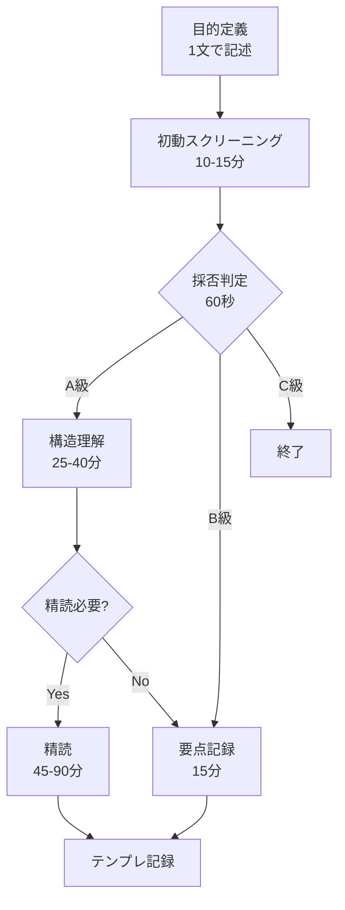

# 技術論文を高速に読むための方法論 - 統合サマリー

## 概要

3つのAIサービス（Claude Code、Codex CLI、Cursor Auto）による技術論文の高速読み方に関する回答を統合したサマリー。情報工学・ソフトウェア工学分野における論文のインプット速度向上のための実践的方法論。

## 共通する核心的アプローチ

### 1. 三段階読み方システム

全ての回答で共通する段階的アプローチ：

#### 第1段階：初動スクリーニング（5-15分）

- **Abstract → Introduction → Conclusion** の順で読む
- 図表を優先的に確認（アーキテクチャ図、結果グラフ）
- 問題設定、新規性、主要結果を1-2行で抽出
- **60秒で採否判定**：A級（精読）、B級（要点のみ）、C級（終了）

#### 第2段階：構造理解（15-40分）

- Related Work で既存研究との差分を確認
- Methodology/Algorithm の核心部分を理解
- 実験設定と評価の妥当性を検証
- 反証可能性と限界を特定

#### 第3段階：精読（必要時のみ、45-90分）

- 数式・証明の厳密な理解
- 実装詳細と再現可能性の確認
- 自分の研究への適用可能性評価

### 2. 時間管理の鉄則

| フェーズ | Claude Code | Codex CLI | Cursor Auto | 統合推奨 |
|---------|------------|-----------|-------------|----------|
| 初動判定 | 5-10分 | 10-15分 | 5-10分 | **10-15分** |
| 構造理解 | 15-30分 | 25-40分 | 30-45分 | **25-40分** |
| 精読（選択） | 2-4時間 | 45-90分 | 45-60分 | **45-90分** |

**重要**：時間箱（タイムボックス）制約を設け、25分×2-3セットで打ち切る

## 効率化のための共通テクニック

### 1. キーワード・概念の抽出

- 論文の主要概念を**3-5個**に絞る
- 既知概念との差分を明確化
- 用語表を作成して理解を整理

### 2. 問題解決フレームワーク

全サービスで共通する理解の枠組み：

```
1. 問題設定：何を解決するか、どの制約下で
2. 新規性：既存手法との差分（1行で表現）
3. 手法：コアアルゴリズム/アーキテクチャ
4. 評価：メトリクス、ベースライン、データセット
5. 限界：適用できない条件、今後の課題
```

### 3. 図表優先アプローチ

- **アーキテクチャ図**：システム全体像の把握
- **アルゴリズム/擬似コード**：実装の理解
- **実験結果グラフ**：性能評価の確認
- **比較表**：既存手法との差別化

## 大量論文処理の実践戦略

### 1. 論文の分類システム

| 分類 | 基準 | 処理方法 | 時間配分 |
|------|------|----------|----------|
| **A級** | 直接関連・新規性高 | 精読 | 45-90分 |
| **B級** | 間接関連・参考価値 | 要点のみ | 15-30分 |
| **C級** | 低関連・既知内容 | スキップ | 5分以内 |

### 2. バッチ処理とクラスタリング

- 同トピックの論文を**まとめて処理**
- 3-5クラスタに分類し、各クラスタから代表1-2本を選抜
- マトリクス表で横断的に比較

### 3. 記録・管理テンプレート

```markdown
## 論文タイトル
- 1行要約：[問題/手法/結果]
- 強み：[2点以内]
- 弱み：[2点以内]
- 前提/限界：[最重要1-2点]
- 実装可否：[依存/リソース/データ]
- 次アクション：[読む/試す/比較 3件以内]
```

## 分野特化の着眼点（情報工学・ソフトウェア工学）

### システム論文

- アーキテクチャ図から全体構成を理解
- スループット、レイテンシ、スケーラビリティを評価
- 一貫性 vs 可用性のトレードオフ
- 実装の現実性とコスト

### アルゴリズム論文

- 擬似コードから実装を理解
- 時間・空間計算量の分析
- ベンチマークとベースラインの妥当性
- アブレーションスタディの有無

### 評価の妥当性チェック

- [ ] ベースラインは適切か
- [ ] データセットは現実的か
- [ ] メトリクスは目的に合致するか
- [ ] アブレーションで貢献を検証しているか
- [ ] 再現に必要な情報（ハイパラ、種、コード）があるか

## ツール活用と自動化

### 推奨ツール

- **文献管理**：Zotero、Mendeley
- **知識ベース**：Notion、Obsidian
- **PDF注釈**：重要箇所のハイライトとメモ
- **AI支援**：要約生成、図表解釈、評価監査

### AIプロンプト活用例

```
1. 要約抽出：「Abstract、Introduction、Conclusionから問題/差分/結果/前提/限界を各1文で」
2. 図解化：「主要図の構成要素とデータフローを箇条書きで」
3. 評価監査：「ベースライン、データ、指標、アブレーションの妥当性を検査」
4. 再現計画：「実装の最小構成とテストケース、必要データを列挙」
```

## アンチパターン（避けるべき読み方）

1. ❌ **線形精読**：最初から最後まで逐語的に読む
2. ❌ **図表無視**：本文だけを追って図表を見ない
3. ❌ **目的不明確**：何を知りたいか定めずに読む
4. ❌ **評価軽視**：実験の妥当性を確認せず結果を受け入れる
5. ❌ **時間無制限**：打ち切り時間を設定しない

## 実践フロー（最小実装）



## まとめ

効率的な論文読みの鍵は：

1. **段階的フィルタリング**で時間を最適配分
2. **図表優先**で全体像を素早く把握
3. **時間箱制約**で深入りを防ぐ
4. **テンプレート化**で記録と比較を効率化
5. **目的明確化**で必要な情報だけを抽出

この方法論により、従来の1/3から1/5の時間で論文の要点を把握し、真に重要な論文にリソースを集中できる。継続的な実践により、パターン認識が向上し、さらなる高速化が可能となる。